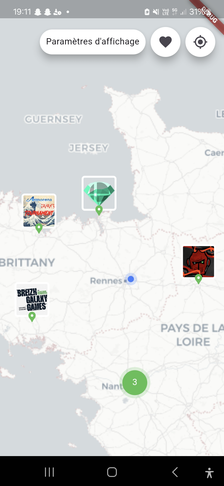

# Maps.gg

Maps.gg is a mobile application built with Flutter that helps users find esports
and fighting game tournaments on an interactive map, using data from the
[start.gg](https://www.start.gg/) API. A first version of the app will soon be
available on the Google Play Store.

## Overview

Maps.gg assists esports and fighting game enthusiasts in locating tournaments
near them or in specific regions using start.gg data. Start.gg is a comprehensive
platform for organizing and participating in gaming tournaments, providing tools
for registration, score tracking, and bracket management, widely used by esports
communities around the world. The app is build with a simple, intuitive interface,
users can explore available tournaments, view event details, and easily navigate
to discover the competitions that interest them.

## Features

- **Tournament Search on a Map**: Users can locate tournaments on an interactive map.
- **Custom Filters**: Search by region, date, game type, and more.
- **Event Details**: Detailed information on each tournament, including participants, dates, and rules.
- **Intuitive Navigation**: A smooth user interface that enables easy navigation throughout the app.

## Technologies Used

- **Framework**: Flutter
- **Language**: Dart
- **API**: [start.gg API](https://developer.start.gg/docs/intro) for tournament data
- **Map**: [flutter_map](https://pub.dev/packages/flutter_map) with OpenStreetMap

## Installation and Local Deployment

To clone and run the project locally:

1. Clone this repository:

    With HTTPS

    ```bash
    git clone https://github.com/RomainHer/maps.gg.git

    ```

    With SSH

    ```bash
    git clone git@github.com:RomainHer/maps.gg.git
    ```

2. Enter the project directory:

    ```bash
    cd maps.gg
    ```

3. Install Flutter dependencies:

    ```bash
    flutter pub get
    ```

4. Get your own API token from start.gg

    1. Go to **[start.gg](https://start.gg)**
    2. Create an **account**
    3. Go to **Developer Settings** > **Personal Access Tokens** to create your token
    4. Save it everywhere you want (for example: in a .env file)

5. Check if you have all the necessary tools

    ```bash
    flutter doctor
    ```

6. Check if you have any devices or emulators available

    ```bash
    flutter devices
    ```

    ```bash
    flutter emulators
    ```

7. Run the app on a simulator or physical device:

    ```bash
    flutter run --dart-define API_KEY=put_your_token_here
    ```

    > **_NOTE:_** if the "Running Gradle task 'assembleDebug'..." takes too long, you can try to run `flutter clean` and then `flutter run` again. Or go to the android folder and run `./gradlew clean` and then `flutter run` again.

### Bonus : Run with VScode debugger

1. Copy and rename launch.json.exemple to launch.json

2. replace all "put_your_token_here" in the launch.json file by your Start.gg Token

3. Select your device :

    1. Do Ctrl+Maj+P in VScode
    2. Search for "Flutter: Select device"
    3. Select your device

4. Go to VScode debugger and click on run button

## Build app locally

1. Build APK

    ```bash
    flutter build apk --dart-define API_KEY=your_api_key_startgg
    ```

2. Install on your device

    ```bash
    flutter install
    ```

## Screenshots



## TCUs and Privacy Policies

- [Terms and Conditions of Use](./TCU.md)
- [Privacy Policy](./PrivacyPolicies.md)

## Contributions

Contributions are welcome! If you'd like to contribute, please open an issue to discuss potential changes before creating a pull request.

- [Issues](https://github.com/RomainHer/RomainHer.github.io/issues)
- [Pull Requests](https://github.com/RomainHer/RomainHer.github.io/pulls)

## Contact

For any questions or suggestions, feel free to contact me via email, discord, or connect with me on LinkedIn.

- [LinkedIn](https://www.linkedin.com/in/romain-heriteau-1b902b205)
- [Discord](https://discordapp.com/users/620287550577180715)
- <romain.heriteau1@gmail.com>

Thank you for using Maps.gg! Enjoy discovering and joining esports tournaments near you.
